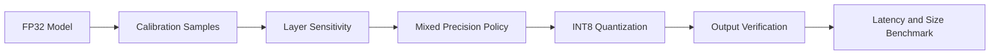

# Edge Quantization Lab

A dependency-free mixed-precision quantization workbench that measures layer sensitivity, reconstruction error, latency, and model-size trade-offs before edge deployment.

This repository implements an original, laptop-scale reference system for a
production problem that repeatedly appears in strong AI/ML/software-engineering
portfolios. It focuses on architecture, failure handling, evaluation, and
reproducibility instead of claiming access to proprietary infrastructure.

## What is implemented

- Symmetric INT8 per-tensor and per-channel quantization
- Layer-by-layer sensitivity analysis against an FP32 reference
- Automatic mixed-precision policy under an error budget
- Deterministic inference, latency sampling, and model-size accounting
- Pareto-style report across quality, speed, and memory

## Architecture



## Quick start

```bash
python -m venv .venv
source .venv/bin/activate
python -m pip install -e .
python -m unittest discover -s tests -v
PYTHONPATH=src python src/edge_quantization_lab/core.py
```

The demo prints a self-contained JSON report from seeded synthetic fixtures;
wall-clock latency values are machine-dependent. It is safe to run offline and
does not require credentials, paid APIs, GPUs, or employer data.

## Evaluation contract

A small seeded MLP is evaluated on held-out synthetic vectors. The report includes output MSE, top-1 agreement, serialized weight bytes, and median local inference time. Results characterize this reference implementation only.

## Repository layout

- `src/edge_quantization_lab/core.py` - executable reference implementation
- `tests/test_core.py` - deterministic regression and failure-path tests
- `benchmark-report.json` - checked-in output from the deterministic demo
- `.github/workflows/ci.yml` - clean-install CI on Python 3.12

## Scope and provenance

The problem definition was inspired by recurring engineering patterns observed
while reviewing a large resume corpus. All naming, source code, fixtures, and
documentation in this repository are original. Reported demo numbers are local
synthetic measurements, not production claims. The system is intentionally
compact so reviewers can inspect every design decision.

## License

MIT
