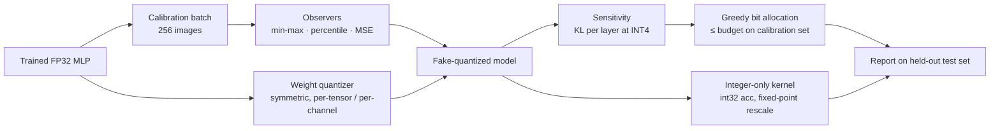

# Edge Quantization Lab

[](https://github.com/asher0913/edge-quantization-lab/actions/workflows/ci.yml)

[](LICENSE)

Post-training quantization implemented from first principles in NumPy: symmetric and affine
quantizers, per-tensor and per-channel weight scales, three activation-calibration observers,
per-layer sensitivity analysis, mixed-precision search under an accuracy budget, and an
**integer-only inference kernel** (int8 × int8 → int32 with fixed-point requantization) that is
checked against the floating-point simulation.

Everything is measured on a real trained network, not random matrices: a 64-256-128-10 MLP
(50,826 parameters) on the 8×8 handwritten-digits set bundled with scikit-learn, over **5 seeds**,
each with its own train / calibration / test split. Every quantization decision uses only the
256-image calibration set; the test set is used for reporting.

## Quick start

```bash
git clone https://github.com/asher0913/edge-quantization-lab && cd edge-quantization-lab
./scripts/demo.sh
```

This needs Python 3.10+ and no GPU, and takes about 25 seconds on a laptop, including creating
`.venv`. The script:

1. checks the SHA-256 of the dataset;
2. trains the five seed models;
3. reruns every table and figure input on this page;
4. compares all 354 numbers with the committed `results/*.json`.

Fresh outputs, the environment and the log go to `runs/demo/`. The `quickstart` CI job runs the
same script on a clean Ubuntu runner and uploads `runs/demo/` as an artifact.
[`results/demo_run.log`](results/demo_run.log) is the log of one such run, for reading without
running anything.

## Results

| Recipe | Test accuracy % | Top-1 agreement with FP32 | Output KL | Size | Compression |
|---|---:|---:|---:|---:|---:|
| FP32 | 98.18 ± 0.37 | 100% | 0 | 198.5 KiB | 1.0× |
| W8A8, per-tensor, min-max | 98.13 ± 0.34 | 99.96% | 3×10⁻⁵ | 50.8 KiB | 3.9× |
| W8A8, per-channel, MSE | 98.13 ± 0.37 | 99.96% | 2×10⁻⁵ | 52.3 KiB | 3.8× |
| W4A8, per-tensor | 97.87 ± 0.40 | 99.20% | 6.3×10⁻³ | 26.2 KiB | 7.6× |
| W4A8, per-channel | 97.69 ± 0.34 | 99.24% | 4.2×10⁻³ | 27.7 KiB | 7.2× |
| W4A4, per-channel | 97.64 ± 0.25 | 99.16% | 5.7×10⁻³ | 27.7 KiB | 7.2× |
| Mixed precision, greedy search in KL order (0.5% budget) | 97.82 ± 0.40 | 99.47% | 3.6×10⁻³ | 31.0 KiB | 6.4× |
| **Mixed precision, greedy search in KL-per-byte order (0.5% budget)** | **97.87 ± 0.46** | **99.51%** | **3.2×10⁻³** | **29.6 KiB** | **6.7×** |
| W3A8, per-channel | 97.07 ± 0.91 | 98.31% | 2.3×10⁻² | 21.5 KiB | 9.2× |
| W2A8, per-channel | 66.89 ± 13.23 | 67.47% | 1.06 | 15.4 KiB | 12.9× |

*Real data: the 1,797 scans are the UCI handwritten-digits set bundled with scikit-learn. Mean ± std over 5 seeds (450 test images each). "Output KL" is KL(FP32 ‖ quantized) between softmax
outputs; it separates recipes long before accuracy does. Size includes int32 biases and one FP32
scale per tensor or channel. Reproduce with `edge-quant benchmark --out results/benchmark.json`
(about 3 s on a laptop).*

**Integer-only kernel.** Running W8A8 with nothing but integer arithmetic after the input layer
reproduces the simulated model's top-1 prediction on 100% of test images across all 5 seeds. The
hidden-layer codes differ in 0.0025% of positions, never by more than 1 LSB; those differences come
from the fixed-point rescale rounding exact .5 ties differently from floating point.


What the sweeps show:

- **8 bits is free, 4 bits is cheap, 2 bits is a cliff.** Accuracy is flat down to 5-bit weights,
  loses 0.3–0.5 points at 4 bits and 1.1 at 3 bits, then collapses at 2 bits.
- **Per-channel scales cut output KL by a third to a half at every bit-width** and are the difference
  between a usable and an unusable model at 2 bits (66.9% vs 32.0% accuracy). At 4 bits the
  accuracy gap is inside seed-to-seed noise; KL still tells them apart.
- **Calibration matters when activation levels are scarce.** An MSE-optimal clipping range lowers
  output KL by 63% versus min-max at 2-bit activations, 32% at 3 bits and 30% at 4 bits; at 8 bits
  all three observers are equivalent.
- **Mixed precision buys most of INT4's size at a fraction of its error.** The byte-aware search
  keeps one layer at 8 bits on 3 of 5 seeds and drops everything else to 4 bits. It lands at
  6.7× compression, with lower KL than any uniform 4-bit recipe.

### Ablation: is the greedy search good enough?

With three layers and two bit-widths there are only 2³ = 8 assignments, so the exhaustive optimum
can be computed and the greedy search checked against it
([`results/search_ablation.json`](results/search_ablation.json), `edge-quant ablate-search`):

| Seed | Greedy, KL order | Greedy, KL per byte saved | Exhaustive optimum |
|---:|---|---|---|
| 0 | W[8,4,4], 36,560 B | **W[4,4,8], 29,008 B** | W[4,4,8], 29,008 B |
| 1 | W[4,4,8], 29,008 B | W[4,4,8], 29,008 B | W[4,4,8], 29,008 B |
| 2 | W[4,4,4], 28,368 B | W[4,4,4], 28,368 B | W[4,4,4], 28,368 B |
| 3 | W[4,4,4], 28,368 B | W[4,4,4], 28,368 B | W[4,4,4], 28,368 B |
| 4 | W[8,4,4], 36,560 B | W[8,4,4], 36,560 B | W[8,4,4], 36,560 B |

The first version sorted layers by sensitivity alone and missed the optimum on seed 0. It lowered
the 1,280-weight output layer first because that layer was the least sensitive. That used up the
budget, so the 16,384-weight input layer had to stay at 8 bits, costing 26% more bytes. Dividing
sensitivity by the bytes a layer would save fixes the order. The greedy search then matches the
exhaustive optimum on 5 of 5 seeds, with 2n quantized forward passes instead of 2ⁿ.

## How it works



- **Quantizers** (`quant.py`). Weights: symmetric signed, restricted range [−127, 127] so that zero
  and ±max are exact. Activations: asymmetric unsigned with a zero point, which suits post-ReLU
  tensors. Biases live on the accumulator grid (`scale_in × scale_w`) as saturating int32.
- **Observers.** Min-max uses the observed extremes; percentile clips at the 0.01st and 99.99th
  percentiles; MSE searches 121 log-spaced clipping ratios for the one that minimises
  reconstruction error on the calibration tensor.
- **Sequential calibration** (`qmodel.py`). Each layer's activation range is calibrated on the
  output of the already-quantized layers before it, so ranges match what the deployed model sees.
- **Integer kernel.** Each layer computes `acc = (q_in − z_in) · W_q + b_q` in int64 (int32 in
  hardware), then applies the per-channel multiplier `M = s_in·s_w / s_out` as a 31-bit mantissa
  and a rounding right shift, the representation used by gemmlowp and TFLite. The ReLU is the lower
  clamp at the output zero point.
- **Mixed-precision search** (`search.py`). Rank layers by INT4 sensitivity (softmax KL on
  calibration data, larger layers first on ties), then lower each one to INT4 only if calibration
  accuracy stays within the budget of FP32.

## Design trade-offs

| Decision | Chosen | Alternative | Why |
|---|---|---|---|
| Implementation | NumPy from scratch | `torch.ao.quantization`, TensorRT | Every rounding, clamp and scale is visible and unit-tested; the cost is no convolutions and no latency numbers (see Limitations). |
| Weight grid | symmetric, [−127, 127] | full [−128, 127] | Zero and ±max are exact and there is no zero point in the weight path. The cost is one unused code. |
| Activation grid | asymmetric, unsigned, with zero point | symmetric | Post-ReLU tensors are non-negative, so a symmetric grid would waste half its codes. The cost is one zero-point subtraction per layer in the integer kernel. |
| Calibration | sequential, on already-quantized inputs | each layer on FP32 inputs | Ranges match what the deployed model sees; costs one extra pass per layer. |
| Search | greedy, KL per byte saved | exhaustive or ILP | Linear in depth. It matches the exhaustive optimum on all 5 seeds here; on deep networks it has no optimality guarantee. |
| Selection data | 256-image calibration split | test set | The test set is never used for a decision. |

## Failure cases

- **2-bit weights collapse.** W2A8 per-channel falls to 66.9 ± 13.2% accuracy; per-tensor falls
  to 32.0%. The ±13-point spread across seeds means that at 2 bits the outcome depends heavily on
  the particular trained model.
- **Sensitivity alone orders layers badly.** See the ablation above: the KL-only greedy search
  kept the largest layer at 8 bits on seed 0.
- **The integer kernel differs from simulation by 1 LSB on 0.0025% of codes.** The fixed-point
  rescale rounds exact .5 ties away from zero; NumPy rounds them to even. Top-1 predictions still
  agree on 100% of test images.
- **Dead ReLU units broke the first integer kernel** (next section).

## A deployment bug this caught

The first version of the integer kernel hit invalid integer casts on some seeds. The cause was
**dead ReLU units**: weight decay drove every weight of a few channels to about 10⁻²⁴, so the per-channel scale became
10⁻²⁶ and the bias, stored as `bias / (s_in · s_w)`, overflowed int64. The fix mirrors production
runtimes: a floor on each channel's weight range and int32 saturation of quantized biases. Both
are covered by tests.

## Evidence and CI coverage

| Claim | Data | Evidence | Rerun in CI? |
|---|---|---|---|
| Recipe table, integer-kernel equivalence | real (digits) | `results/benchmark.json` | Yes: `quickstart` compares all 133 numbers |
| Bit-width sweeps | real (digits) | `results/bit_sweep.json` | Yes: all 121 numbers |
| Greedy vs exhaustive search | real (digits) | `results/search_ablation.json` | Yes: all 100 numbers |
| Figure `docs/bit_sweep.png` | real (digits) | drawn by `scripts/make_figures.py` from `bit_sweep.json` | No; the numbers behind it are checked |
| Quantizer properties | synthetic tensors and the seed-0 model | `tests/`, 45 tests | Yes, on Python 3.10 and 3.12 |

Reproducibility details:

- Seeds are 0–4. Each seed fixes the stratified train, calibration and test split
  (`load_digits_splits`) and the weight initialisation and batch order (`train_mlp`).
- The dataset checksum is SHA-256 `f6d9e39f…b70443` over the float64 pixels and int64 labels.
  `scripts/demo.sh` verifies it.
- Nothing is downloaded at run time, so there is no external data version to pin.

## Code map

Read in this order:

| File | What to look at |
|---|---|
| `src/edge_quant/quant.py` | `weight_qparams`, `activation_qparams`, `observe_range` (the three observers), `quantize_multiplier` and `rounding_right_shift` (fixed-point requantization) |
| `src/edge_quant/qmodel.py` | `QuantizedMLP`, the fake-quantized model with sequential calibration; `IntegerMLP`, the integer-only kernel |
| `src/edge_quant/search.py` | `layer_sensitivity`, `search_mixed_precision` (greedy, two orders), `exhaustive_search` |
| `src/edge_quant/benchmark.py` | `RECIPES`, `run_benchmark`, `integer_equivalence`, `bit_sweep`, `search_ablation` |
| `src/edge_quant/model.py` | the NumPy MLP, Adam training and the seeded splits |
| `tests/test_quant.py`, `tests/test_models.py`, `tests/test_search.py` | the properties above, one test each |

## Usage

```bash
pip install -e '.[dev]'

edge-quant benchmark --seeds 5 --out results/benchmark.json
edge-quant sweep --seeds 5 --out results/bit_sweep.json
edge-quant ablate-search --seeds 5 --out results/search_ablation.json
edge-quant sensitivity --bits 4
edge-quant search --budget 0.005
python scripts/make_figures.py     # needs matplotlib
```

```python
from edge_quant.model import load_digits_splits, train_mlp
from edge_quant.qmodel import QuantConfig, QuantizedMLP, IntegerMLP

splits = load_digits_splits(seed=0)
model = train_mlp(splits.x_train, splits.y_train, seed=0)
qmodel = QuantizedMLP(model, QuantConfig.uniform(3, 8, 8, observer="mse"), splits.x_calib)
logits = IntegerMLP(qmodel).forward(splits.x_test)  # integer arithmetic end to end
```

## Tests

`pytest -q` runs 45 tests in about 5 seconds: round-trip error bounded by half a quantization step,
per-channel never worse than per-tensor, zero exactly representable, observer behaviour on an
outlier, fixed-point multiplier accuracy to 2⁻³⁰, integer rounding against float rounding,
byte accounting, the integer kernel within 1 LSB of simulation, rejection of partially quantized
models in the integer path, the mixed-precision search staying within its budget, and the
exhaustive search returning the smallest assignment within budget.

## Limitations

- The model is deliberately small so the whole study runs on a CPU in seconds. Convolutions,
  batch-norm folding, depthwise layers and attention bring quantization issues (outlier channels,
  large activation ranges) that an MLP on 8×8 digits does not exhibit.
- Latency is not reported. NumPy has no int8 GEMM, so timing the integer kernel here would say
  nothing about an NPU, DSP or TensorRT engine; the value of this code is numerical fidelity.
- Only post-training quantization is covered. Quantization-aware training is the usual next step
  for the 3- and 2-bit regimes and is not implemented here.
- With 450 test images, one image is 0.22 points, so accuracy differences under about 0.4 points
  are within seed noise; the KL and agreement columns are the more sensitive signals.

## License

MIT
